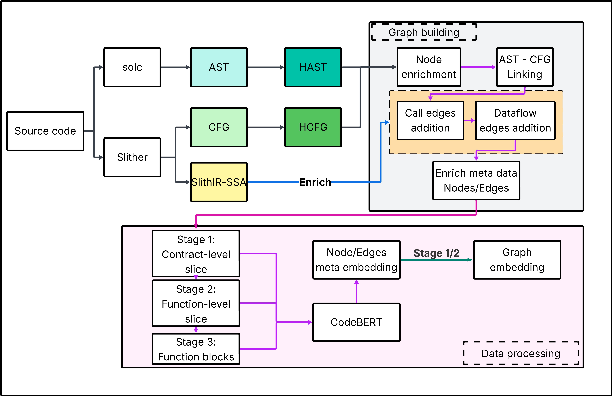

# README

## Dir tree
```
.
├── DAppSCAN-sources/
├── DAppSCAN-bytecode/
├── b1_modules/
├── c2_build_CPG_modules/
├── project_json/
│   ├── <project>.json
│   └── ...
├── ProcessedData/
│   ├── benign/
│   │   └── <project>/
│   │       └── ...
│   └── <project>/
│       ├── cpg_combined.pkl
│       └── line_level_vulnerabilities.json
├── Logs/
├── jdk-17.0.12/
├── Extracted_Graphs/ (contains ./b1_GraphExtractor.py output)/
│   └── <project>/
│       ├── ABI/
│       │   ├── <sol file>_ast.json
│       │   └── ...
│       ├── CFG/
│       │   └── *.dot
│       └── IR/
│           └── ir_*.json
]
├── a0_fix_name.ps1
├── b1_GraphExtractor.py
├── e5_preprocess_data.py
└── EtherSolve.jar
└── venv ( if needed)
```
## Run
- Run `a0_fix_name.ps1` to fix name
- Run b`1_GraphExtractor.py` - it use `b1_modules/`- and use Slither create CFG, IR ; solc for AST; module auto install solc and npm libraries
- Run `e5_preprocess_data.py` - it use `c2_build_CFG_modules/` to process as follows:
  -  Build HAST graphs from ASTs
  -  Build HCFG graphs from CFGs
  -  Annotate IR to sequence of order data flow for DataFlow Edges
  -  Link CFG-AST by name and Expression matching
  -  Add DataFlow based on IR matching
  -  Add Call Edges by expression and IR matching
  -  Annotate node id with vulnerabilities 
